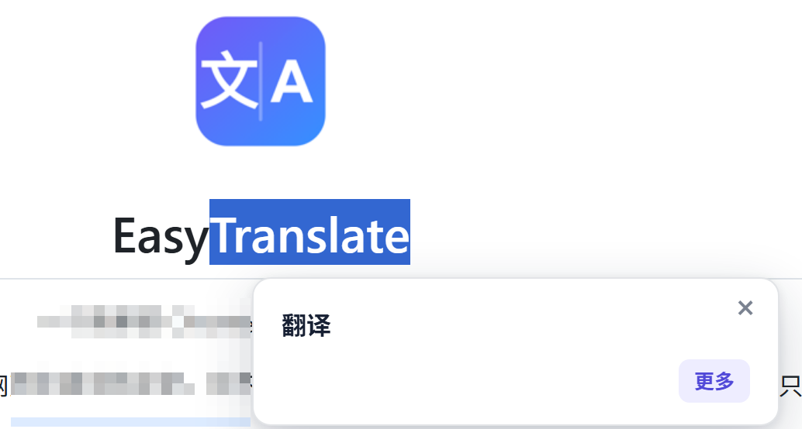
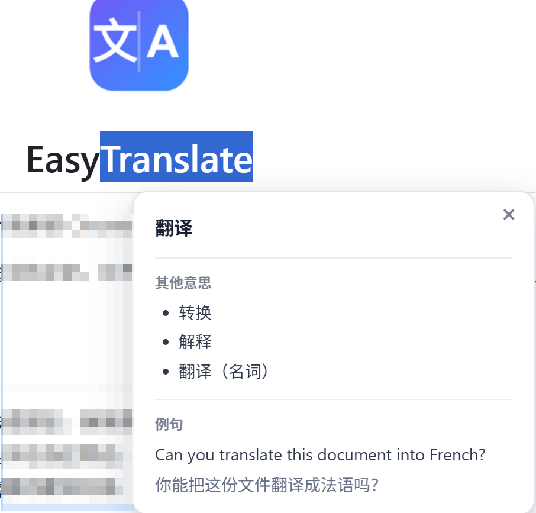
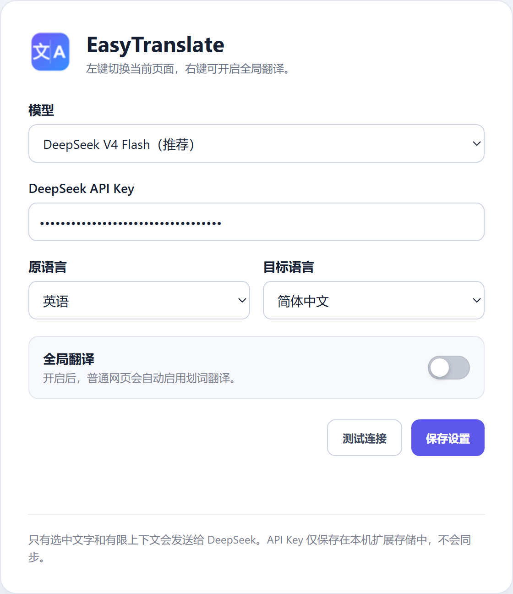

<div align="center">
  
  <h1>EasyTranslate</h1>
  <p><a href="README.md">中文</a> · <strong>English</strong></p>
  <p>A simple selection translator for Chrome.</p>
</div>

EasyTranslate uses DeepSeek to translate text selected on a web page. It adds no floating icons and avoids unnecessary features, so you can stay focused on reading.

## Highlights

- **No visual clutter**: No floating icons or buttons are added to web pages.
- **Select to translate**: Select text and the translation appears beside it.
- **Immersive experience**: The clean popup shows only useful translation content and disappears automatically.
- **Translation only**: No ads, memberships, points, paid add-ons, or unrelated features.
- **Use your own API**: The extension calls DeepSeek directly with your own API Key. There is no third-party relay server.
- **Context-aware**: Nearby text is used as context to improve translation accuracy.

The default language direction is English to Simplified Chinese, and it can be changed in Settings. Click “More” for other meanings and a short bilingual example. Basic translations are cached on the current page for two days; “More” results are never cached.

## Examples

Select to translate · View more meanings and examples

<p>
  
  &nbsp;&nbsp;
  
</p>

Configure the model, API Key, and languages

<p>
  
</p>

## Install

1. Download and extract this project.
2. Open `chrome://extensions/` in Chrome.
3. Turn on “Developer mode” in the top-right corner.
4. Click “Load unpacked”.

## Use

1. Right-click the extension icon and open “Options”.
2. Choose a model, enter your DeepSeek API Key, and save the settings.
3. Left-click the extension icon to enable translation on the current page.
4. Select text on the page to see the translation beside it.

Left-click the icon again to turn translation off for the current page. To enable it automatically on regular web pages, turn on “Global translation” in Settings or use the extension’s right-click menu.

The translation popup disappears automatically after 10 seconds. Click the popup or its `×` button to close it immediately. Clicking “More” keeps the popup open.

## Notes

- DeepSeek is currently the only supported API, and model usage may cost money.
- Your API Key is stored only in your local browser. Never commit it to GitHub or post it in an Issue.
- After updating the code, reload the extension at `chrome://extensions/` and refresh any open web pages.

See the [privacy notice](docs/PRIVACY.md) for details about data use.

## Development

No build step is required. After making changes, run:

```bash
npm run check
```

Licensed under the [MIT License](LICENSE).
